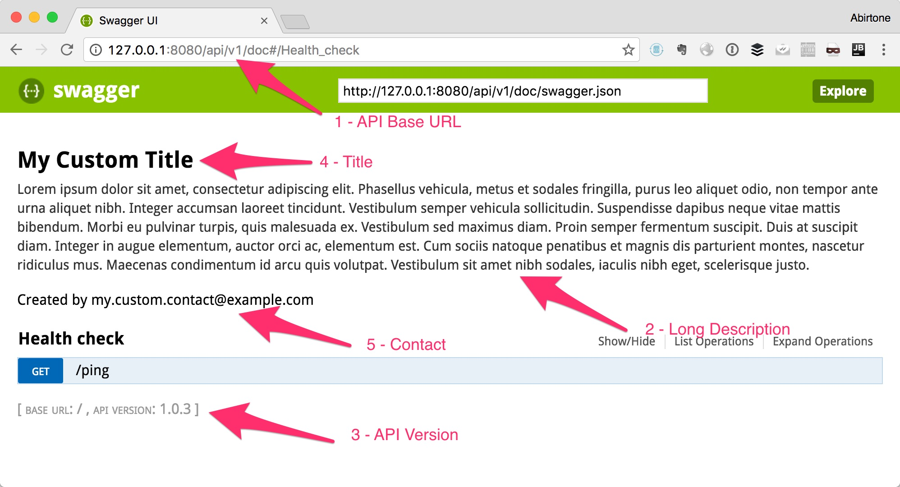
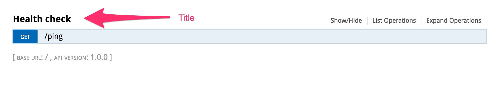

aiohttp-swagger
===============


*aiohttp-swagger: Swagger API Documentation builder for aiohttp server*

Code | https://github.com/cr0hn/aiohttp-swagger
---- | ----------------------------------------------
Issues | https://github.com/cr0hn/aiohttp-swagger/issues/
Python version | Python 3.5 and above

What's aiohttp-swagger
----------------------

aiohttp-swagger is a plugin for aiohttp.web server that allow to document APIs using Swagger show the Swagger-ui console. 

Installation
------------

### Simple

Install aiohttp-swagger is so easy:

```
$ python3.5 -m pip install aiohttp-swagger
```

### With extra performance

Aiohttp-swagger also includes some optional dependencies to add extra performance but requires a bit different installation, because they (usually) depends of C extensions.

To install the tool with extra performance you must do:

```
$ python3.5 -m pip install 'aiohttp-swagger[performance]'
```

**Remember that aiohttp-swagger only runs in Python 3.5 and above**.

Quick start
-----------

Document an API is so simple:

```python

from aiohttp import web
from aiohttp_swagger import *


async def ping(request):
    """
    ---
    description: This end-point allow to test that service is up.
    tags:
    - Health check
    produces:
    - text/plain
    responses:
        "200":
            description: successful operation. Return "pong" text
        "405":
            description: invalid HTTP Method
    """
    return web.Response(text="pong")


app = web.Application()
app.router.add_route('GET', "/ping", ping)

setup_swagger(app)

web.run_app(app, host="127.0.0.1")
```

It produces:


Where to access to API Doc
--------------------------

By default, API will be generated at URL: yourdomain.com**/api/doc**.

You can modify the URI adding the parameter **swagger_url** in **setup_swagger**:

```python

from aiohttp import web
from aiohttp_swagger import *

async def ping(request):
    """
    ---
    description: This end-point allow to test that service is up.
    tags:
    - Health check
    produces:
    - text/plain
    responses:
        "200":
            description: successful operation. Return "pong" text
        "405":
            description: invalid HTTP Method
    """
    return web.Response(text="pong")


app = web.Application()
app.router.add_route('GET', "/ping", ping)

setup_swagger(app, swagger_url="/api/v1/doc")  # <-- NEW Doc URI

web.run_app(app, host="127.0.0.1")
```

Customizing Doc description and more
------------------------------------

You can change this valued for Swagger doc:

1. API Base URL: Modify global prefix of your API.
2. Description: Long description of your API
3. API Version: Version of your API
4. Title: Title for your API
5. Contact: Contact info.

```python

from aiohttp import web
from aiohttp_swagger import *

async def ping(request):
    """
    ---
    description: This end-point allow to test that service is up.
    tags:
    - Health check
    produces:
    - text/plain
    responses:
        "200":
            description: successful operation. Return "pong" text
        "405":
            description: invalid HTTP Method
    """
    return web.Response(text="pong")

app = web.Application()

app.router.add_route('GET', "/ping", ping)

long_description = """
Lorem ipsum dolor sit amet, consectetur adipiscing elit. Phasellus vehicula, metus et sodales fringilla, purus leo aliquet odio, non tempor ante urna aliquet nibh. Integer accumsan laoreet tincidunt. Vestibulum semper vehicula sollicitudin. Suspendisse dapibus neque vitae mattis bibendum. Morbi eu pulvinar turpis, quis malesuada ex. Vestibulum sed maximus diam. Proin semper fermentum suscipit. Duis at suscipit diam. Integer in augue elementum, auctor orci ac, elementum est. Cum sociis natoque penatibus et magnis dis parturient montes, nascetur ridiculus mus. Maecenas condimentum id arcu quis volutpat. Vestibulum sit amet nibh sodales, iaculis nibh eget, scelerisque justo.

Nunc eget mauris lectus. Proin sit amet volutpat risus. Aliquam auctor nunc sit amet feugiat tempus. Maecenas nec ex dolor. Nam fermentum, mauris ut suscipit varius, odio purus luctus mauris, pretium interdum felis sem vel est. Proin a turpis vitae nunc volutpat tristique ac in erat. Pellentesque consequat rhoncus libero, ac sollicitudin odio tempus a. Sed vestibulum leo erat, ut auctor turpis mollis id. Ut nec nunc ex. Maecenas eu turpis in nibh placerat ullamcorper ac nec dui. Integer ac lacus neque. Donec dictum tellus lacus, a vulputate justo venenatis at. Morbi malesuada tellus quis orci aliquet, at vulputate lacus imperdiet. Nulla eu diam quis orci aliquam vulputate ac imperdiet elit. Quisque varius mollis dolor in interdum.
"""

setup_swagger(app,
              description=long_description,
              title="My Custom Title",
              api_version="1.0.3",
              contact="my.custom.contact@example.com")

web.run_app(app, host="127.0.0.1")
```

It produces:




Adding Swagger from external file
---------------------------------

### Per End-Point level

We can add the Swagger doc from an external YAML file at end-point level. You only need to decorate the end-point function handler:

```python

from aiohttp import web
from aiohttp_swagger import *


@swagger_path("example_swagger_partial.yaml")  # <-- Load Swagger info from external file
async def example_2(request):
    """
    Example 3 handler description. This description is only for Sphinx.
    """
    return web.Response(text="Example")


async def example_3(request):
    """
    Description end-point
    """
    return web.Response(text="Example")

app = web.Application()

app.router.add_route('GET', "/example1", example_1)
app.router.add_route('GET', "/example2", example_2)

setup_swagger(app)

web.run_app(app, host="127.0.0.1")

```

External file must have this format:

```yaml

tags:
- user
summary: Create user
description: This can only be done by the logged in user.
operationId: examples.api.api.createUser
produces:
- application/json
parameters:
- in: body
  name: body
  description: Created user object
  required: false
  schema:
    type: object
    properties:
      id:
        type: integer
        format: int64
      username:
        type:
          - "string"
          - "null"
      firstName:
        type: string
      lastName:
        type: string
      email:
        type: string
      password:
        type: string
      phone:
        type: string
      userStatus:
        type: integer
        format: int32
        description: User Status
responses:
  "201":
    description: successful operation

```

**Pay attention that file doesn't contain information about HTTP Method o End-Point name. This information will be added automatically**.

### Global Swagger YAML

aiohttp-swagger also allow to build an external YAML Swagger file and load it before:

```python

from aiohttp import web
from aiohttp_swagger import *

async def ping(request):
    """
    This is my usually Sphinx doc

    >>> import json
    >>> ping(None)
    
    :param request: Context injected by aiohttp framework
    :type request: RequestHandler
    """
    return web.Response(text="pong")

app = web.Application()

app.router.add_route('GET', "/ping", ping)

setup_swagger(app, swagger_from_file="example_swagger.yaml")  # <-- Loaded Swagger from external YAML file

web.run_app(app, host="127.0.0.1")
```

F.A.Q.
------

- Q: Where start the Swagger documentation in my function doc?
- A: aiohttp-swagger try to find the string **---**. When it find this string pattern, the next text until the end of function are considered Swagger doc.

- Q: Can I Combine the Swagger documentation with my usually Sphinx doc?
- A: Sure! Your Sphinx doc must be first of the **---** limiter.

```python

async def ping(request):
    """
    This is my usually Sphinx doc
    
    >>> import json
    >>> ping(None)
    
    :param request: Context injected by aiohttp framework  
    :type request: RequestHandler 
    
    ---
    description: This end-point allow to test that service is up.
    tags:
    - Health check
    produces:
    - text/plain
    responses:
        "200":
            description: successful operation. Return "pong" text
        "405":
            description: invalid HTTP Method
    """
```

- Q: How can I group a list of End-Point?
- A: End-Point will be grouped by their title. The end-point with the same title will be grouped automatically:



- Q: How can I change the Title of a group of End-Points?
- A: Swagger has a tag that uses to build the titles. The tag name is **tags**. The format is:
 
```yaml
tags:  # <-- TAG USEF FOR THE TITLE
- Health check
description: This end-point allow to test that service is up.
produces:
- text/plain
responses:
    "200":
        description: successful operation. Return "pong" text
    "405":
        description: invalid HTTP Method
```

- Q: What happens if I use YAML file and function documentation for build Swagger doc at the same time?
- A: If two method are provided, aiohttp-swagger will use the YAML over the function doc.

Swagger Documentation & Examples
--------------------------------

You can read the Swagger parameters and format at:

[OpenAPI Spec](https://github.com/OAI/OpenAPI-Specification/blob/master/versions/2.0.md)
    
If you need more examples, there're some available in at folder: [aiohttp_swagger/examples](https://github.com/cr0hn/aiohttp-swagger/tree/master/aiohttp_swagger/examples).

What's new?
-----------

### Version 1.0.0

- First version released

You can read entire list in [CHANGELOG](https://github.com/cr0hn/aiohttp-swagger/blob/master/CHANGELOG) file.